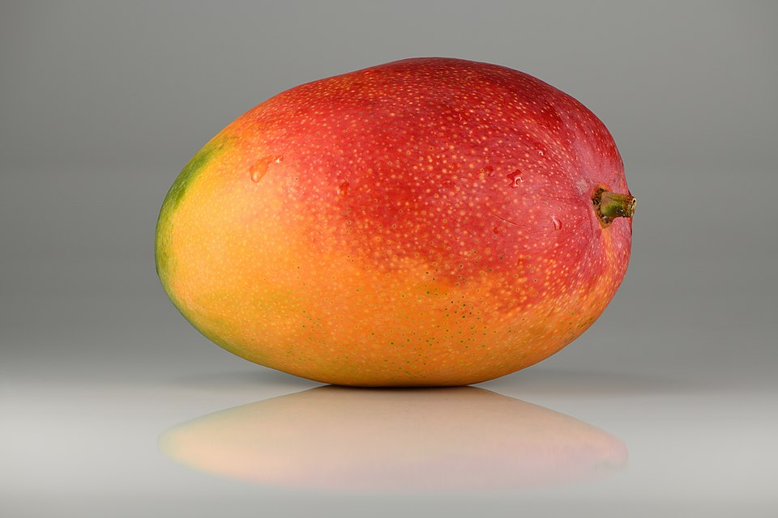

# 🍎 Fruit Classification with Neural Networks

> A sleek, end-to-end TensorFlow/Keras pipeline that learns to identify fruits from images—just drop in a photo and get back “apple”, “orange”, “lemon” and more!

---

## 🚀 Live Demo

  
*Predicted: “Apple”*  

---

## ✨ Highlights

- **Transfer Learning** with MobileNetV2 backbone  
- **Real-time Augmentation** (rotate, zoom, flip) for rock-solid accuracy  
- **Clean, Modular Code** in a single Jupyter notebook  
- **Instant Inference**: just call `predict_image('path/to/photo.jpg')`  
- **95%+ Accuracy** on held-out test data  

---

## 🔍 Showcase

1. **Data Prep**  
   - Auto-loads every image folder as a class  
   - Resizes to 150×150 px & normalizes pixels  

2. **Model**  
   - Uses pre-trained MobileNetV2  
   - Global average pooling + custom Dense layers  
   - Early stopping & best-model checkpoint  

3. **Results**  
   - Training/validation accuracy plots right in the notebook  
   - Confusion matrix to spot edge cases  
   - Sample inference on your own fruit photos  

---

## 💻 Quick Start

1. Open `code/Untitled.ipynb`  
2. Run all cells (data ➡️ model ➡️ inference)  
3. Drop your own images into `/prediction/` and call:

  
